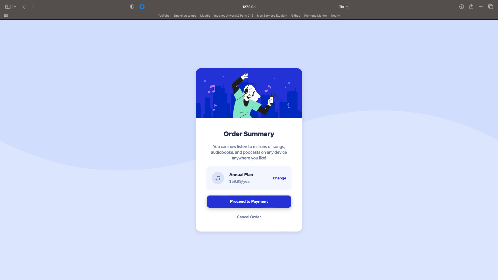

# Frontend Mentor - Order summary card solution

This is a solution to the [Order summary card challenge on Frontend Mentor](https://www.frontendmentor.io/challenges/order-summary-component-QlPmajDUj). Frontend Mentor challenges help you improve your coding skills by building realistic projects. 

## Table of contents

- [Overview](#overview)
  - [The challenge](#the-challenge)
  - [Screenshot](#screenshot)
  - [Links](#links)
- [My process](#my-process)
  - [Built with](#built-with)
  - [What I learned](#what-i-learned)
  - [Continued development](#continued-development)
  - [Useful resources](#useful-resources)
- [Author](#author)

## Overview

### The challenge

Users should be able to:

- See hover states for interactive elements

### Screenshot




### Links

- Live Site URL: https://fantastic-queijadas-140382.netlify.app

## My process

### Built with

- Semantic HTML5 markup
- CSS custom properties
- Flexbox

### What I learned

I learn how to use background position and how to put a pattern in a background.

```css
body{
    background-image: url(images/pattern-background-desktop.svg);
    background-repeat: no-repeat;
    background-size: contain;
    background-position-y: -20%;
}
```

### Continued development

I want to start to learn JavaScript (Because i don't know how to use Javascript and his libraries) and learn how to use grid. I want to learn how to use perfectly box shadow too.

### Useful resources

- [Pierre Giraud](https://www.pierre-giraud.com/html-css-apprendre-coder-cours/) - The website's in french but you can also learn how to use JavaScript. This is with that than i learn how to use HTML and CSS to make websites.

## Author

- Github - [Isekku](https://github.com/Isekku)
- Frontend Mentor - [@Isekku](https://www.frontendmentor.io/profile/Isekku)
- Twitter - [@kesusama](https://www.twitter.com/kesusama)